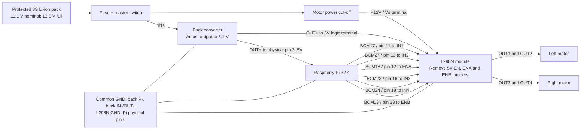

# Raspberry Pi two-motor speed and steering controller

Run two small 12 V rated brushed DC motors through one L298N module, with a
**speed slider** and a **left/right steering slider** in a browser on the same
local network. Both wheels drive forward; turning reduces the inside motor's
PWM duty cycle. There is no reverse or counter-rotating spin mode.

The page shows the requested settings, each motor's applied PWM command, and
an illustration of the commanded turn. The requested **0-100 km/h display is
a virtual scale**: 1% on the speed slider is displayed as 1 virtual km/h.
It is not measured or estimated physical vehicle speed. There are no wheel
encoders in this project.

This reference wiring assumes a **Raspberry Pi 3 or 4 with a 40-pin header**,
a common L298N module with flyback diodes, and a protected **3S Li-ion pack**
using ordinary 4.2 V full-charge cells. The Pi model, motor rated voltage and
**stall current**, buck rating, and exact L298N module must be checked before
connecting power. A motor's no-load current is not enough to size its driver.
A standard toy wheel does not identify its motor's voltage rating: do not
connect a 3-6 V toy motor to this 12 V motor-supply design.

## How the two sliders work

1. **Speed: 0-100%.** Choose the forward PWM command. Before starting, changing
   the sliders only changes the requested settings. Press Start to enable
   drive; subsequent slider movements update the motors while running.
2. **Steering: -100 to +100.** Centre is straight. Left is negative and reduces
   the left motor's PWM; right is positive and reduces the right motor's PWM.
   Further from centre gives a larger difference between the motors.
3. **Stop / reset** disables both motors. Setting speed to zero also ends the
   run. Choose a nonzero speed and press Start again to resume; restoring a
   network connection does not resume a previous run.

Example with speed set to 60% (displayed as **60 virtual km/h**):

| Steering setting | Left motor PWM | Right motor PWM | Intended motion |
| --- | --- | --- | --- |
| Centre, 0% | 60% | 60% | Straight |
| Left, 25% | 45% | 60% | Gentle left |
| Left, 50% | 30% | 60% | Sharper left |
| Left, 100% | 0% | 60% | Strongest left command |
| Right, 50% | 60% | 30% | Sharper right |
| Right, 100% | 60% | 0% | Strongest right command |

The mixer uses `t = speed` and `s = steering / 100`:

```text
left_pwm  = t * (1 + min(s, 0))
right_pwm = t * (1 - max(s, 0))
```

Both commands remain between 0 and 100%. The outside motor stays at the speed
slider's duty cycle; the inside motor receives less drive. The speed slider
does not hold the robot's average ground speed constant during a turn.
At maximum steering the inside motor is unpowered and can coast, rather than
being locked in place.

This is differential steering: the wheels do not rotate to a car-like steering
angle. A steering setting of 50% does not mean a 50-degree heading or wheel
angle. The path illustration shows the intended turn, not tracked movement.
Load, battery voltage, wheel slip and motor mismatch affect the actual path;
equal PWM does not guarantee equal wheel RPM. See [differential-drive kinematics](https://docs.wpilib.org/en/stable/docs/software/kinematics-and-odometry/differential-drive-kinematics.html).

To add physical speed measurement later, use wheel encoders and known wheel
circumference; distance per wheel revolution times revolutions per second
gives wheel speed. Wheel spacing is also needed to infer turning from the two
wheel speeds. An IMU can help measure actual heading changes. None of those
measurements is fabricated by the virtual km/h display.

## Connection diagram

Open [the full wiring diagram](docs/wiring.svg) in a browser to zoom or print.


The battery feeds two parallel branches. The motor supply goes directly to the
driver; the buck supplies the Pi and the driver's logic.



The SVG includes the return connections and separate ENA/ENB pull-down resistors.
These are module-terminal diagrams, not a schematic for a bare L298 chip.

### Power connections

Disconnect the battery and USB power while wiring. Identify terminals from your
module's labels; their physical order differs between boards.

| From | To |
| --- | --- |
| Protected pack output P+ | Fuse near pack, then master switch |
| Master switch output | Buck IN+ |
| Master switch output | Motor cut-off switch, then L298N `+12V` / `Vs` |
| Protected pack output P- | Common ground point |
| Buck IN- and OUT- | Common ground point |
| Buck OUT+, adjusted to 5.1 V | Pi **physical pin 2**, labelled **5V** |
| Buck OUT+ | L298N `5V` logic terminal, **with 5V-EN jumper removed** |
| Pi physical pin 6, GND | Common ground point |
| L298N GND | Common ground point, with its own motor-current return wire |
| L298N OUT1 and OUT2 | Left motor's two leads |
| L298N OUT3 and OUT4 | Right motor's two leads |

Use the BMS-protected **pack output**, not an individual cell tap or raw cell
negative that bypasses the BMS. Follow the pack manufacturer's charging-port
instructions. A 3S pack is approximately 11.1 V nominal and 12.6 V full; it is
not a regulated 12 V supply. Use its matching 3S Li-ion charger. The buck is
not a battery charger, and a protection BMS is not a charger either. These
[example pack protection specifications](https://www.batteryspace.com/prod-specs/3228-PCB-S3A10L-GS.pdf)
illustrate the distinction; use the specifications for your own pack.

### Control connections

The Python code uses **BCM GPIO numbers**. Physical header pin numbers are
different: **physical pin 2 is a 5V power pin; BCM GPIO2 is not**.

| Pi BCM number | Physical header pin | L298N connection | Purpose |
| --- | --- | --- | --- |
| GPIO17 | 11 | IN1 | Left direction input 1 |
| GPIO27 | 13 | IN2 | Left direction input 2 |
| GPIO18 | 12 | ENA | Left PWM speed / enable |
| GPIO23 | 16 | IN3 | Right direction input 1 |
| GPIO24 | 18 | IN4 | Right direction input 2 |
| GPIO13 | 33 | ENB | Right PWM speed / enable |
| GND | 6 | GND | Shared signal reference |

Fit **two separate 10 kOhm resistors**, one between ENA and GND and the other
between ENB and GND, at the driver. They hold both bridges disabled during
startup. Remove the **ENA and ENB jumpers** before connecting their Pi signals;
leaving them fitted can connect the Pi signal pins to the module's 5V rail.

**If upgrading the earlier one-motor wiring, remove the direct ENB-to-GND
wire.** ENB now connects to GPIO13 and has a 10 kOhm pull-down to GND; it must
not be directly shorted to GND.

Also remove the separate **5V-EN regulator jumper** before connecting external
5V to the module. This design uses the buck as the only 5V source. Never use
the L298N module's small onboard regulator to power the Pi. Verify these
jumper functions against your actual board; the chip datasheet alone does
not define module jumpers. See the [SunFounder module documentation](https://docs.sunfounder.com/projects/sf-components/en/latest/component_l298n_module.html).

The L298 accepts a logic HIGH from 2.3 V, so the Pi's 3.3 V outputs can drive
all four direction inputs and both enable inputs directly. Keep 5V and battery
voltage off the Pi's signal pins. Each motor connects **between its two bridge
outputs**, never from an output to ground.
See the [ST L298 datasheet](https://www.st.com/resource/en/datasheet/l298.pdf).

Wire each motor so IN1 HIGH / IN2 LOW and IN3 HIGH / IN4 LOW move the robot
forward. Since the left and right motors usually face opposite directions,
their wire colours need not match at OUT1 and OUT3. With power disconnected,
swap the two leads of any motor that drives its wheel backwards.

### Supply and motor limits

- **Set and measure the buck output before attaching the Pi.** Use a regulated
  5.1 V output and check it again at the Pi under load. Header power connects
  directly to the 5V rail and bypasses input protection on models that provide
  it. Add appropriate external overcurrent/reverse-polarity protection; never
  apply 12 V to the Pi. Connect only one Pi power source at a time: disconnect
  USB power, PoE and other powered headers when using this circuit. See the
  [official Raspberry Pi HAT power design guide](https://github.com/raspberrypi/hats/blob/master/designguide.md#back-powering-the-pi-via-the-gpio-header).
- **Buck current:** budget 2.5 A for a Pi 3 or 3 A for a Pi 4, plus L298N logic
  and peripheral load with margin. A buck rated for at least 4 A continuous
  at this input/output voltage is a useful Pi 4 target; verify its actual
  thermal rating. Use short, current-rated wires and a secure power connector,
  not a breadboard or loose thin signal jumpers. A Pi 5 normally has a 5 A
  supply recommendation; review its power distribution before reusing this
  Pi 3/4 design. See [Raspberry Pi power requirements](https://www.raspberrypi.com/documentation/computers/raspberry-pi.html#power-supply).
- **Driver current:** the L298's 2 A DC figure per bridge is a chip maximum,
  not a guarantee that a small module can continuously deliver that current.
  Check each motor's stall/startup current and the combined module heating.
  Pack/BMS, wiring and fuse ratings must cover both motors plus the Pi branch.
  Do not select a fuse value until these ratings are known.
- **Voltage loss:** the L298 loses several volts across its output transistors
  under load, so a 12 V input does not give the motor a full 12 V. That loss
  also creates heat. PWM percentage controls duty cycle, not measured RPM;
  low duty cycles can leave a motor stalled. See the [ST electrical ratings](https://www.st.com/resource/en/datasheet/l298.pdf).
- **Noise and returns:** return motor current directly to the power ground
  point, not through the Pi or its thin ground lead. Use a module with its
  required flyback diodes and supply decoupling fitted. Keep motor wires short
  or twisted; a 100 nF ceramic capacitor across a brushed motor's terminals
  is a common noise-suppression measure. Do not add a single diode across a
  motor that will reverse polarity.
- **Stopping:** ENA and ENB LOW remove drive and the wheels coast. The software
  watchdog is not a physical emergency stop and cannot guarantee a stop if
  the OS or process freezes. Use the accessible motor power cut-off switch.
  Open it and select Stop before restoring motor power, so an old command
  cannot restart the motor unexpectedly.

## Install and run on the Raspberry Pi

Use a current Raspberry Pi OS installation. Copy this project to the Pi, open
a terminal in its directory, and run:

```bash
sudo apt update
sudo apt install -y python3-venv python3-gpiozero python3-lgpio
python3 -m venv --system-site-packages .venv
source .venv/bin/activate
python -m pip install -r requirements.txt
python app.py
```

The server listens on port **8000**. Keep it running in this terminal; press
Ctrl+C to stop the server and release the GPIO pins. Run one server instance
only. Do not enable Flask's development reloader or use multiple worker
processes, which would contend for the same GPIO pins.

Find the Pi's network address in another terminal:

```bash
hostname -I
```

On a phone or computer connected to the same LAN/Wi-Fi, open:

```text
http://<PI_IP_ADDRESS>:8000
```

For example, if the Pi reports `192.168.1.50`, open
`http://192.168.1.50:8000`. No internet connection is needed once installed.
Guest Wi-Fi isolation or a firewall can prevent access; allow TCP port 8000
only from the trusted local network. This demonstration has **no login**:
anyone with network access to the Pi can control the motor. Do not forward
the port to the public internet.

Choose speed and steering, then press Start. Keep the controlling page visible:
it refreshes a short command lease; loss of contact disables drive after
approximately 2 seconds while the server is healthy. Closing or hiding the
page also attempts an immediate Stop. Restoring a connection does not restart
the motors automatically. After a timeout, press **Stop / reset** before
starting again.

## Test without a Raspberry Pi

Simulation never opens GPIO devices. On a normal computer with Python 3.10+
installed, create a virtual environment, install `requirements.txt`, then run:

```bash
python app.py --simulate --host 127.0.0.1
```

Open `http://127.0.0.1:8000`. On Windows PowerShell, virtual-environment setup is:

```powershell
python -m venv .venv
.\.venv\Scripts\python.exe -m pip install -r requirements.txt
.\.venv\Scripts\python.exe app.py --simulate --host 127.0.0.1
```

Run the automated controller/API tests from the project directory:

```bash
python -m unittest discover -s tests -v
```

For the browser controller's request-ordering and slider tests, use Node.js
if installed (Node is not needed to run the Pi server):

```bash
node tests/ui_control.mjs
```

Simulation checks software behavior only; it cannot verify wiring, supply
stability, motor current, cooling, or actual wheel motion. Both simulation and
hardware mode label the km/h scale as virtual, because neither reads encoders.

## First powered test

1. Leave the motor power cut-off open. With the Pi disconnected, adjust the
   buck and measure 5.1 V with correct polarity. Power off before connecting
   the Pi and the module's logic supply; check all three jumper removals.
2. Power the Pi, start the app, and confirm the page reports stopped. Secure
   the chassis with both wheels lifted clear. Close the motor power switch.
3. Centre the steering slider and use a short moderate-speed test. Stop if
   either wheel fails to turn, the driver heats rapidly, or the Pi resets.
   Do not leave a stalled motor on.
4. Confirm both wheels drive forward. If one is backwards, stop, disconnect
   power and swap that motor's two leads. Test left steering: left PWM must
   decrease while right PWM stays at the speed setting. Test right similarly.
5. Run briefly and close the browser or disconnect its Wi-Fi. Verify the
   drive is removed within about 2 seconds and does not resume on reconnect.
6. Stop, open the motor cut-off, and shut down the Pi with `sudo poweroff`
   before opening the master switch in normal use.

## Files

- `app.py`: HTTP endpoints, server startup, GPIO/simulation selection.
- `motor_controller.py`: two-motor mixing, GPIO, ownership and watchdog behavior.
- `templates/index.html`: two sliders, motor outputs and commanded-turn illustration.
- `static/`: browser interaction code.
- `docs/wiring.svg`: printable connection diagram.
- `tests/`: automated software checks using simulated hardware.

Software uses [Flask](https://flask.palletsprojects.com/en/stable/),
[Waitress](https://docs.pylonsproject.org/projects/waitress/en/stable/), and
[GPIO Zero](https://gpiozero.readthedocs.io/en/stable/). The hardware adapter
explicitly selects the `lgpio` backend; Raspberry Pi OS supplies its native
dependency through the `python3-lgpio` package above.
