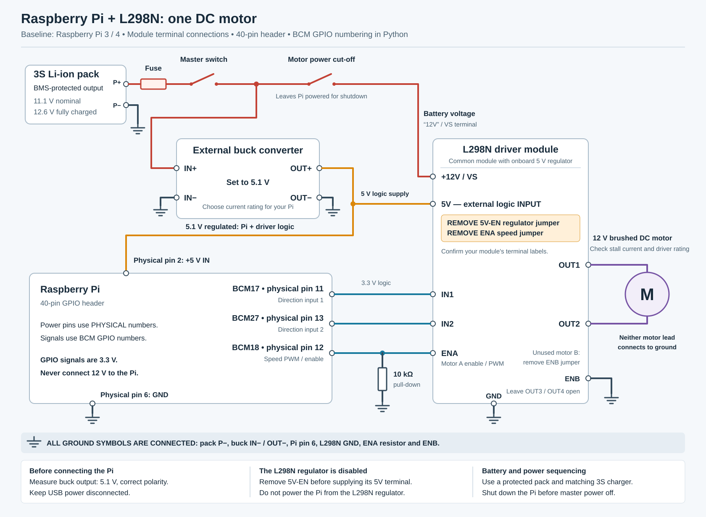
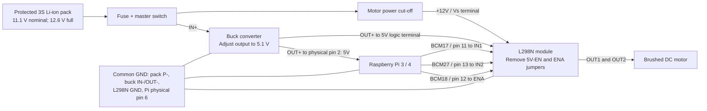

# Raspberry Pi DC motor controller

Run one small 12 V rated brushed DC motor through an L298N module, with forward, reverse,
stop and PWM speed control from a browser on the same local network.

This reference wiring assumes a **Raspberry Pi 3 or 4 with a 40-pin header**,
a common L298N module with flyback diodes, and a protected **3S Li-ion pack**
using ordinary 4.2 V full-charge cells. The Pi model, motor rated voltage and
**stall current**, buck rating, and exact L298N module must be checked before
connecting power. A motor's no-load current is not enough to size its driver.

## Connection diagram

Open [the full wiring diagram](docs/wiring.svg) in a browser to zoom or print.



The battery feeds two parallel branches. The motor supply goes directly to the
driver; the buck supplies the Pi and the driver's logic.



The SVG includes the complete return connections and the ENA pull-down resistor.
These are module-terminal diagrams, not a schematic for a bare L298 chip.

### Power connections

Disconnect the battery and USB power while wiring. Identify terminals from your
module's labels; their physical order differs between boards.

| From | To |
| --- | --- |
| Protected pack output P+ | Fuse near pack, then master switch |
| Master switch output | Buck IN+ |
| Master switch output | Motor cut-off switch, then L298N `+12V` / `Vs` |
| Protected pack output P- | Common ground point |
| Buck IN- and OUT- | Common ground point |
| Buck OUT+, adjusted to 5.1 V | Pi **physical pin 2**, labelled **5V** |
| Buck OUT+ | L298N `5V` logic terminal, **with 5V-EN jumper removed** |
| Pi physical pin 6, GND | Common ground point |
| L298N GND | Common ground point, with its own motor-current return wire |
| L298N OUT1 and OUT2 | The two motor leads |

Use the BMS-protected **pack output**, not an individual cell tap or raw cell
negative that bypasses the BMS. Follow the pack manufacturer's charging-port
instructions. A 3S pack is approximately 11.1 V nominal and 12.6 V full; it is
not a regulated 12 V supply. Use its matching 3S Li-ion charger. The buck is
not a battery charger, and a protection BMS is not a charger either. These
[example pack protection specifications](https://www.batteryspace.com/prod-specs/3228-PCB-S3A10L-GS.pdf)
illustrate the distinction; use the specifications for your own pack.

### Control connections

The Python code uses **BCM GPIO numbers**. Physical header pin numbers are
different: **physical pin 2 is a 5V power pin; BCM GPIO2 is not**.

| Pi BCM number | Physical header pin | L298N connection | Purpose |
| --- | --- | --- | --- |
| GPIO17 | 11 | IN1 | Direction |
| GPIO27 | 13 | IN2 | Direction |
| GPIO18 | 12 | ENA | PWM speed / enable |
| GND | 6 | GND | Shared signal reference |

Fit a **10 kOhm resistor between ENA and GND**, at the driver. It holds the
bridge disabled while the Pi pins are inputs during startup. Remove the
**ENA jumper** before connecting GPIO18; leaving it fitted can connect the Pi
signal to the module's 5V rail. For the unused second channel, remove its ENB
jumper and connect ENB to GND; leave OUT3 and OUT4 disconnected.

Also remove the separate **5V-EN regulator jumper** before connecting external
5V to the module. This design uses the buck as the only 5V source. Never use
the L298N module's small onboard regulator to power the Pi. Verify these
jumper functions against your actual board; the chip datasheet alone does
not define module jumpers. See the [SunFounder module documentation](https://docs.sunfounder.com/projects/sf-components/en/latest/component_l298n_module.html).

The L298 accepts a logic HIGH from 2.3 V, so the Pi's 3.3 V outputs can drive
IN1, IN2 and ENA directly. Keep 5V and battery voltage off the Pi's signal pins.
The motor connects **between OUT1 and OUT2**, never from one output to ground.
See the [ST L298 datasheet](https://www.st.com/resource/en/datasheet/l298.pdf).

### Supply and motor limits

- **Set and measure the buck output before attaching the Pi.** Use a regulated
  5.1 V output and check it again at the Pi under load. Header power connects
  directly to the 5V rail and bypasses input protection on models that provide
  it. Add appropriate external overcurrent/reverse-polarity protection; never
  apply 12 V to the Pi. Connect only one Pi power source at a time: disconnect
  USB power, PoE and other powered headers when using this circuit. See the
  [official Raspberry Pi HAT power design guide](https://github.com/raspberrypi/hats/blob/master/designguide.md#back-powering-the-pi-via-the-gpio-header).
- **Buck current:** budget 2.5 A for a Pi 3 or 3 A for a Pi 4, plus L298N logic
  and peripheral load with margin. A buck rated for at least 4 A continuous
  at this input/output voltage is a useful Pi 4 target; verify its actual
  thermal rating. Use short, current-rated wires and a secure power connector,
  not a breadboard or loose thin signal jumpers. A Pi 5 normally has a 5 A
  supply recommendation; review its power distribution before reusing this
  Pi 3/4 design. See [Raspberry Pi power requirements](https://www.raspberrypi.com/documentation/computers/raspberry-pi.html#power-supply).
- **Driver current:** the L298's 2 A DC figure per bridge is a chip maximum,
  not a guarantee that a small module can continuously deliver that current.
  Check motor stall/startup current, module cooling, pack/BMS current and fuse
  ratings. Do not select a fuse value until these ratings are known.
- **Voltage loss:** the L298 loses several volts across its output transistors
  under load, so a 12 V input does not give the motor a full 12 V. That loss
  also creates heat. PWM percentage controls duty cycle, not measured RPM;
  low duty cycles can leave a motor stalled. See the [ST electrical ratings](https://www.st.com/resource/en/datasheet/l298.pdf).
- **Noise and returns:** return motor current directly to the power ground
  point, not through the Pi or its thin ground lead. Use a module with its
  required flyback diodes and supply decoupling fitted. Keep motor wires short
  or twisted; a 100 nF ceramic capacitor across a brushed motor's terminals
  is a common noise-suppression measure. Do not add a single diode across a
  motor that will reverse polarity.
- **Stopping:** ENA LOW removes drive and the shaft coasts. The software
  watchdog is not a physical emergency stop and cannot guarantee a stop if
  the OS or process freezes. Use the accessible motor power cut-off switch.
  Open it and select Stop before restoring motor power, so an old command
  cannot restart the motor unexpectedly.

## Install and run on the Raspberry Pi

Use a current Raspberry Pi OS installation. Copy this project to the Pi, open
a terminal in its directory, and run:

```bash
sudo apt update
sudo apt install -y python3-venv python3-gpiozero python3-lgpio
python3 -m venv --system-site-packages .venv
source .venv/bin/activate
python -m pip install -r requirements.txt
python app.py
```

The server listens on port **8000**. Keep it running in this terminal; press
Ctrl+C to stop the server and release the GPIO pins. Run one server instance
only. Do not enable Flask's development reloader or use multiple worker
processes, which would contend for the same GPIO pins.

Find the Pi's network address in another terminal:

```bash
hostname -I
```

On a phone or computer connected to the same LAN/Wi-Fi, open:

```text
http://<PI_IP_ADDRESS>:8000
```

For example, if the Pi reports `192.168.1.50`, open
`http://192.168.1.50:8000`. No internet connection is needed once installed.
Guest Wi-Fi isolation or a firewall can prevent access; allow TCP port 8000
only from the trusted local network. This demonstration has **no login**:
anyone with network access to the Pi can control the motor. Do not forward
the port to the public internet.

Choose a speed and Forward or Reverse. Stop before changing direction and
wait until the shaft is stationary. Keep the controlling page visible:
it refreshes a short command lease; loss of contact disables drive after
approximately 2 seconds while the server is healthy. Closing or hiding the
page also attempts an immediate Stop. Restoring a connection does not restart
the motor automatically. After a timeout, press **Stop / reset** before
starting again.

## Test without a Raspberry Pi

Simulation never opens GPIO devices. On a normal computer with Python 3.10+
installed, create a virtual environment, install `requirements.txt`, then run:

```bash
python app.py --simulate --host 127.0.0.1
```

Open `http://127.0.0.1:8000`. On Windows PowerShell, virtual-environment setup is:

```powershell
python -m venv .venv
.\.venv\Scripts\python.exe -m pip install -r requirements.txt
.\.venv\Scripts\python.exe app.py --simulate --host 127.0.0.1
```

Run the automated controller/API tests from the project directory:

```bash
python -m unittest discover -s tests -v
```

Simulation checks software behavior only; it cannot verify wiring, supply
stability, motor current, cooling, or actual motor direction.

## First powered test

1. Leave the motor power cut-off open. With the Pi disconnected, adjust the
   buck and measure 5.1 V with correct polarity. Power off before connecting
   the Pi and the module's logic supply; check the two jumper removals.
2. Power the Pi, start the app, and confirm the page reports stopped. Secure
   the motor with its shaft/load clear. Close the motor power switch.
3. Use a short moderate-speed test. Stop promptly if it fails to turn, the
   driver heats rapidly, or the Pi resets. Do not leave a stalled motor on.
4. Select Stop and wait for the shaft to stop before Reverse. If the named
   direction is opposite to what you want, disconnect power and swap the
   motor's two leads.
5. Run briefly and close the browser or disconnect its Wi-Fi. Verify the
   drive is removed within about 2 seconds and does not resume on reconnect.
6. Stop, open the motor cut-off, and shut down the Pi with `sudo poweroff`
   before opening the master switch in normal use.

## Files

- `app.py`: HTTP endpoints, server startup, GPIO/simulation selection.
- `motor_controller.py`: motor drive, ownership and watchdog behavior.
- `templates/index.html`: browser controls.
- `docs/wiring.svg`: printable connection diagram.
- `tests/`: automated software checks using simulated hardware.

Software uses [Flask](https://flask.palletsprojects.com/en/stable/),
[Waitress](https://docs.pylonsproject.org/projects/waitress/en/stable/), and
[GPIO Zero](https://gpiozero.readthedocs.io/en/stable/). The hardware adapter
explicitly selects the `lgpio` backend; Raspberry Pi OS supplies its native
dependency through the `python3-lgpio` package above.
